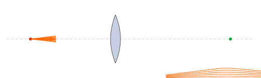
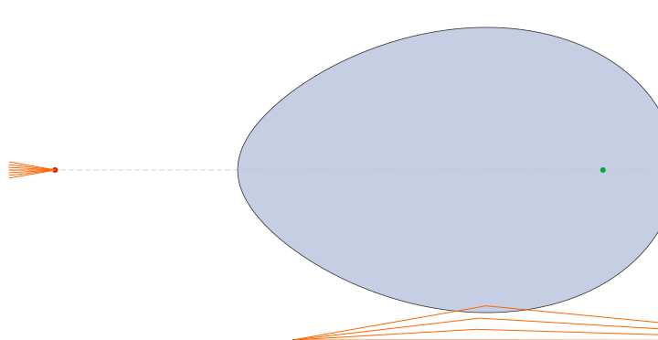

# Stigmatic_RT_Inkscape

> **Honest disclaimer.** This repository is **not** an original work. It is a modification / fork of the excellent
> [inkscape-raytracing](https://github.com/damienBloch/inkscape-raytracing) extension by **Damien Bloch**. All the
> ray-tracing engine, the rendering pipeline and the SVG optical-object conventions are his. The modifications
> added here (two new Inkscape extensions for **stigmatic Cartesian-oval surfaces** and **ovoide LSOE** lenses,
> plus the `gots_util.py` helper and the standalone SVG generator) were written by **Claude Opus 4.6** under my
> supervision. Please cite and star the original project: https://github.com/damienBloch/inkscape-raytracing

---

## What this fork adds

The upstream extension lets you build optical systems in Inkscape using primitives such as mirrors, lenses and
beams, and then traces rays through them. This fork adds two new generator extensions that produce
**rigorously stigmatic** (aberration-free) refractive elements based on the **GOTS** (General Oblique Theory of
Stigmatism) / Cartesian-oval formulation:

| New file | Purpose |
|---|---|
| `inkscape-raytracing/inkscape_raytracing/superficie_cartesiana.py` / `.inx` | Generates a single Cartesian-oval refracting surface (plano-cartesian lens) that images an on-axis object point perfectly into an on-axis image point for given indices `n₁, n₂`. |
| `inkscape-raytracing/inkscape_raytracing/lente_ovoide.py` / `.inx` | Generates a full **LSOE** (Lente Singlete Ovoide Estigmática) — a biconvex / plano-convex / meniscus singlet whose **two** surfaces are Cartesian ovals, designed by the shape factor σ. |
| `inkscape-raytracing/inkscape_raytracing/gots_util.py` | Shared helpers: `calcular_gots`, `perfil_superficie`, `perfil_ovoide_descartes`, `encontrar_apertura`, `calcular_d1_sigma`, `perfil_a_path_str`. |
| `generar_lsoe_svg.py` | Standalone script (no Inkscape needed) that writes a ready-to-trace `lsoe_raytracing.svg`. |

The generated elements are tagged `optics:glass:{n}` and `optics:beam`, so they are picked up directly by the
upstream **Extensions → Optics → Ray Tracing** command.

All source code, labels and comments are in **Spanish** (`fuente`, `apertura`, `angulo_max`, …).

---

## Example results

A biconvex LSOE designed for object at `d₀ = 0 mm`, image at `d₂ = 200 mm`, `n₁ = 1.6`, σ = 0, rays diverging
from the object point:



A single Cartesian-oval plano-convex lens:



All rays converge **exactly** to the image point — there is no spherical aberration by construction.

---

## Installation

### 1. Install Inkscape 1.2 or newer

https://inkscape.org/release/

### 2. Locate your Inkscape user extensions directory

Inside Inkscape open **Edit → Preferences → System** and read the field **User extensions**.
Typical paths:

| OS | Path |
|---|---|
| Linux | `~/.config/inkscape/extensions/` |
| macOS | `~/Library/Application Support/org.inkscape.Inkscape/config/inkscape/extensions/` |
| Windows | `%APPDATA%\inkscape\extensions\` |

### 3. Install this fork

```bash
git clone https://github.com/GoofyCorleone/Stigmatic_RT_Inkscape.git
cd Stigmatic_RT_Inkscape
```

Copy (or symlink) the **contents of** `inkscape-raytracing/inkscape_raytracing/` into your Inkscape user
extensions directory:

```bash
# macOS example
cp -r inkscape-raytracing/inkscape_raytracing/* \
      ~/Library/Application\ Support/org.inkscape.Inkscape/config/inkscape/extensions/

# Linux example
cp -r inkscape-raytracing/inkscape_raytracing/* \
      ~/.config/inkscape/extensions/
```

Restart Inkscape. You should now see, under **Extensions**:

- **Optics → Ray Tracing** (original, traces rays)
- **Generate from Path → Superficie Cartesiana** (new)
- **Generate from Path → Lente Ovoide (LSOE)** (new)

### 4. Python dependencies

Only `numpy` and `scipy` are required at generation time, both of which are bundled with modern Inkscape.
For the standalone script:

```bash
python -m venv venv && source venv/bin/activate
pip install numpy scipy
```

---

## Tutorial: generate and trace an LSOE

### Option A — Inside Inkscape (interactive)

1. Open Inkscape and create a new document.
2. Go to **Extensions → Generate from Path → Lente Ovoide (LSOE)**.
3. Fill in:
   - `n₀ = 1.0`, `n₁ = 1.6`, `n₂ = 1.0`
   - `ζ₀ = 0 mm`, `ζ₁ = 10 mm` (vertex positions of the front/back surface)
   - `d₀ = -80 mm` (object), `d₂ = 110 mm` (image)
   - `σ = 0.0` (symmetric biconvex)
   - `Número de rayos = 9`, `Ángulo máximo = 8°`
4. Press **Apply**. A lens plus a fan of orange beams and an optical axis are drawn.
5. **Select All** (`Ctrl+A`).
6. Go to **Extensions → Optics → Ray Tracing**. The orange lines are replaced by the traced rays that refract
   through the two Cartesian ovals and converge exactly at the image point.

### Option B — Standalone script (no Inkscape GUI)

```bash
python generar_lsoe_svg.py
```

This writes `lsoe_raytracing.svg`. Open it in Inkscape, `Ctrl+A`, **Extensions → Optics → Ray Tracing**.

### Shape factor σ

Changing σ redistributes the curvature between the two surfaces while keeping perfect stigmatism:

| σ | Geometry |
|---|---|
| −1 | plano-convex, flat front |
| 0 | symmetric biconvex |
| +1 | plano-convex, flat back |

Any value in `[-1, +1]` is valid (and values outside produce meniscus singlets when the imaging is still
feasible).

---

## How it works (very briefly)

For each surface the code solves the **GOTS quartic** for the coefficients `(G, O, T, S)` that define the
Cartesian-oval profile

```
z(r) = G + O·r² + T·r⁴ + …         (implicit form solved exactly)
```

such that every ray from the object point refracts through the surface and reaches the image point with
equal optical path length (Fermat's principle). For a singlet, `calcular_d1_sigma` places the intermediate
virtual image so that both surfaces share a consistent shape factor σ.

For the full derivation see the references in `../RayTracing/` (GOTS papers by Silva-Lora and collaborators).

---

## Credits

- **Original extension & ray-tracing engine:** Damien Bloch — https://github.com/damienBloch/inkscape-raytracing
  (GPLv2, see `inkscape-raytracing/LICENSE`).
- **Stigmatic-surface extensions and Spanish port:** Jafert Serrano (GoofyCorleone), authored by
  **Claude Opus 4.6** (Anthropic) acting as pair programmer.
- **GOTS / Cartesian-oval theory:** R. Silva-Lora et al.

If you use this code in academic work please cite the upstream repository and the GOTS papers.

## License

The upstream extension is distributed under the **GPL-2.0** license (see `inkscape-raytracing/LICENSE`).
This fork inherits the same license.
