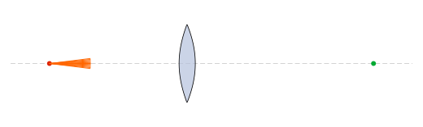
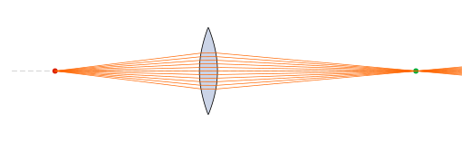
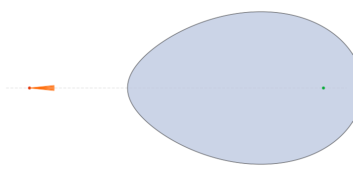
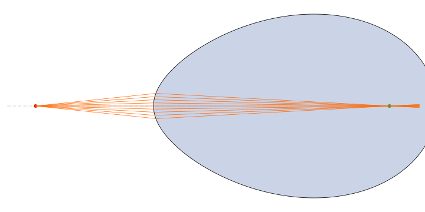
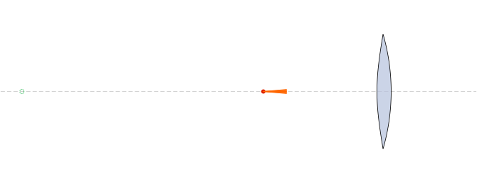
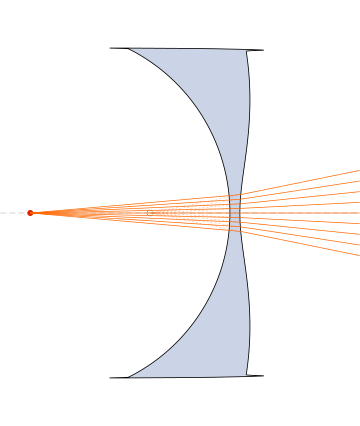
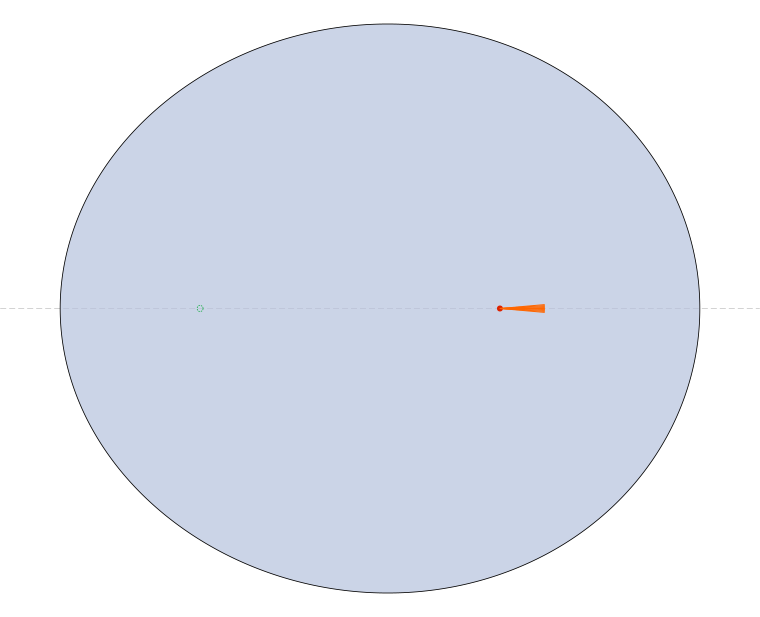
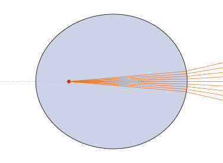

# Stigmatic_RT_Inkscape

> **Honest disclaimer.** This repository is **not** an original work. It is a modification / fork of the excellent
> [inkscape-raytracing](https://github.com/damienBloch/inkscape-raytracing) extension by **Damien Bloch**. All the
> ray-tracing engine, the rendering pipeline and the SVG optical-object conventions are his. The modifications
> added here (two new Inkscape extensions for **stigmatic Cartesian-oval surfaces** and **ovoide LSOE** lenses,
> plus the `gots_util.py` helper and the standalone SVG generator) were written by **Claude Opus 4.6** under my
> supervision. Please cite and star the original project: https://github.com/damienBloch/inkscape-raytracing

---

## What this fork adds

The upstream extension lets you build optical systems in Inkscape using primitives such as mirrors, lenses and
beams, and then traces rays through them. This fork adds two new generator extensions that produce
**rigorously stigmatic** (aberration-free) refractive elements based on the **GOTS** (General Oblique Theory of
Stigmatism) / Cartesian-oval formulation:

| New file | Purpose |
|---|---|
| `inkscape-raytracing/inkscape_raytracing/superficie_cartesiana.py` / `.inx` | Generates a single Cartesian-oval refracting surface (plano-cartesian lens) that images an on-axis object point perfectly into an on-axis image point for given indices `n₁, n₂`. |
| `inkscape-raytracing/inkscape_raytracing/lente_ovoide.py` / `.inx` | Generates a full **LSOE** (Lente Singlete Ovoide Estigmática) — a biconvex / plano-convex / meniscus singlet whose **two** surfaces are Cartesian ovals, designed by the shape factor σ. |
| `inkscape-raytracing/inkscape_raytracing/gots_util.py` | Shared helpers: `calcular_gots`, `perfil_superficie`, `perfil_ovoide_descartes`, `encontrar_apertura`, `calcular_d1_sigma`, `perfil_a_path_str`. |
| `generar_lsoe_svg.py` | Standalone script (no Inkscape needed) that writes a ready-to-trace `lsoe_raytracing.svg`. |
| `generar_ejemplos.py` | Regenerates the four example SVGs in this README (before / after ray tracing, for both elements). |

The generated elements are tagged `optics:glass:{n}` and `optics:beam`, so they are picked up directly by the
upstream **Extensions → Optics → Ray Tracing** command.

All source code, labels and comments are in **Spanish** (`fuente`, `apertura`, `angulo_max`, …).

---

## Example results

A biconvex LSOE designed for object at `d₀ = 0 mm`, image at `d₂ = 200 mm`, `n₁ = 1.6`, σ = 0, with 11
rays diverging up to ±7°, before and after ray-tracing:

| Before tracing (generator output) | After tracing (canonical engine) |
|---|---|
|  |  |

A single Cartesian-oval refracting surface (n₁=1, n₂=1.5, object at −100 mm, image at +200 mm):

| Before | After |
|---|---|
|  |  |

### Divergent configurations

Both elements also produce rigorously stigmatic **virtual** images. A biconcave divergent
LSOE (σ=0, object at `d₀ = −100 mm`, virtual image at `d₂ = −40 mm`) and a concave
Cartesian surface (n₁=1.0, n₂=1.5, object at −100 mm, virtual image at −40 mm) — in both
cases the virtual image lies between the object and the element, as expected from a
diverging optical system:

| Divergent LSOE — before | Divergent LSOE — after |
|---|---|
|  |  |

| Divergent oval — before | Divergent oval — after |
|---|---|
|  |  |

The dashed back-extrapolations of the refracted rays meet exactly at the virtual image point.

All rays converge to the image point (green dot) to numerical precision — these are rigorously
stigmatic surfaces. The path is emitted as cubic Bézier arcs with Catmull–Rom tangents, which gives
O(h⁴) approximation error and eliminates the focus drift that a polyline of `L` segments produces.

---

## Installation

### 1. Install Inkscape 1.2 or newer

https://inkscape.org/release/

### 2. Locate your Inkscape user extensions directory

Inside Inkscape open **Edit → Preferences → System** and read the field **User extensions**.
Typical paths:

| OS | Path |
|---|---|
| Linux | `~/.config/inkscape/extensions/` |
| macOS | `~/Library/Application Support/org.inkscape.Inkscape/config/inkscape/extensions/` |
| Windows | `%APPDATA%\inkscape\extensions\` |

### 3. Install this fork

```bash
git clone https://github.com/GoofyCorleone/Stigmatic_RT_Inkscape.git
cd Stigmatic_RT_Inkscape
```

Copy (or symlink) the **contents of** `inkscape-raytracing/inkscape_raytracing/` into your Inkscape user
extensions directory:

```bash
# macOS example
cp -r inkscape-raytracing/inkscape_raytracing/* \
      ~/Library/Application\ Support/org.inkscape.Inkscape/config/inkscape/extensions/

# Linux example
cp -r inkscape-raytracing/inkscape_raytracing/* \
      ~/.config/inkscape/extensions/
```

Restart Inkscape. You should now see, under **Extensions**:

- **Optics → Ray Tracing** (original, traces rays)
- **Generate from Path → Superficie Cartesiana** (new)
- **Generate from Path → Lente Ovoide (LSOE)** (new)

### 4. Python dependencies

Only `numpy` and `scipy` are required at generation time, both of which are bundled with modern Inkscape.
For the standalone script:

```bash
python -m venv venv && source venv/bin/activate
pip install numpy scipy
```

---

## Tutorial: generate and trace an LSOE

### Option A — Inside Inkscape (interactive)

1. Open Inkscape and create a new document.
2. Go to **Extensions → Generate from Path → Lente Ovoide (LSOE)**.
3. Fill in:
   - `n₀ = 1.0`, `n₁ = 1.6`, `n₂ = 1.0`
   - `ζ₀ = 0 mm`, `ζ₁ = 10 mm` (vertex positions of the front/back surface)
   - `d₀ = -80 mm` (object), `d₂ = 110 mm` (image)
   - `σ = 0.0` (symmetric biconvex)
   - `Número de rayos = 9`, `Ángulo máximo = 8°`
4. Press **Apply**. A lens plus a fan of orange beams and an optical axis are drawn.
5. **Select All** (`Ctrl+A`).
6. Go to **Extensions → Optics → Ray Tracing**. The orange lines are replaced by the traced rays that refract
   through the two Cartesian ovals and converge exactly at the image point.

### Option B — Standalone script (no Inkscape GUI)

```bash
python generar_lsoe_svg.py
```

This writes `lsoe_raytracing.svg`. Open it in Inkscape, `Ctrl+A`, **Extensions → Optics → Ray Tracing**.

### Shape factor σ

Changing σ redistributes the curvature between the two surfaces while keeping perfect stigmatism:

| σ | Geometry |
|---|---|
| −1 | plano-convex, flat front |
| 0 | symmetric biconvex |
| +1 | plano-convex, flat back |

Any value in `[-1, +1]` is valid (and values outside produce meniscus singlets when the imaging is still
feasible).

---

## Using the GOTS parameters directly

The **Superficie Cartesiana** extension has three tabs:

| Tab | What it does |
|---|---|
| **Parámetros Físicos** | You give `n₁, n₂, d₀, d₁, ζ`. The extension calls `calcular_gots` internally to derive `(G, O, T, S, OG)` and draws the full Descartes oval. |
| **Parámetros GOTS** | You give `(G, O, T, S, ζ)` (plus `n₂` from the previous tab) directly — useful when you already know the parameters from a paper (e.g. Table 4 of Silva-Lora 2024) or want to sweep a parameter for pedagogic figures. The oval is drawn closed and complete. |
| **Geometría** | Visualization-only knobs (units, optical axis, object/image markers, ray-fan options). The oval is **always** drawn complete; the legacy `r_apertura` field is ignored. |

### What each GOTS coefficient means

For a surface with vertex at `ζ` separating media `n_k → n_{k+1}`, with object at `d_k`
and image at `d_{k+1}`, Silva-Lora's Eqs. 10–13 give:

| Symbol | Meaning |
|---|---|
| `O` | paraxial curvature at the vertex (`1/R`, signed; units `1/length`) |
| `T` | 4th-order deformation coefficient (`1/length³`) |
| `S` | conic-like coupling term |
| `G` | axial shift `G = OG / O` (with units of length); together with `O` it fixes the on-axis intercept |
| `OG` | the product `O·G`, appears explicitly in the radical of Eq. 16 |
| `ζ`  | axial position of the vertex |

The implicit surface equation (Eq. 16) is

```
τ(ρ) = (O + T·ρ²)·ρ²  /  [1 + S·ρ² + √(1 + (2S − O·OG)·ρ²)]
z(ρ) = ζ + τ(ρ)
```

which is solved exactly — no polynomial expansion is used.

### Recovering physical parameters from GOTS

If you know `(n_k, n_{k+1}, O, T, S)` you can recover `(d_k, d_{k+1})` analytically by
inverting Eqs. 10–13. The helper used internally is purely forward (physical → GOTS),
but the inverse is one-liner algebra if you need it.

### Typical workflow

1. Start in **Parámetros Físicos**: you almost always know `n₁, n₂, d₀, d₁, ζ`.
2. Apply the extension, then open the generated `<desc>` tag to read the derived GOTS
   parameters (they are logged to stderr when the extension runs).
3. If you now want to tweak `T` or `S` independently (e.g. explore a non-physical
   deformation), switch to **Parámetros GOTS**, paste the values, and perturb.

---

## Generating divergent surfaces

Both elements are rigorously stigmatic for **virtual** images too — the same GOTS
machinery handles converging and diverging configurations with no sign conventions
to remember. The only rule:

> For a diverging element with a **real** object, the virtual image must lie
> **between the object and the element** (closer to the element than the object,
> on the same side).

### Divergent single surface (Superficie Cartesiana)

Use the **Parámetros Físicos** tab with both `d₀` and `d₁` negative (same side as the
object) and `|d₁| < |d₀|`. Example (n₁=1, n₂=1.5, ζ=0):

| Field | Value |
|---|---|
| `n₁` | 1.0 |
| `n₂` | 1.5 |
| `d₀` | −100 mm |
| `d₁` | −40 mm |
| `ζ`  | 0 mm |

The result is a concave Cartesian oval. After ray-tracing, the refracted rays
diverge and their back-extrapolations meet exactly at z = −40 mm (virtual image).

### Divergent LSOE (Lente Ovoide)

Use the **Lente Ovoide (LSOE)** extension with both `d₀` and `d₂` negative and
`|d₂| < |d₀|`. Example (σ=0, symmetric biconcave):

| Field | Value |
|---|---|
| `n₀, n₁, n₂` | 1.0, 1.6, 1.0 |
| `ζ₀, ζ₁` | 0 mm, 5 mm |
| `d₀` | −100 mm |
| `d₂` | −40 mm |
| `σ` | 0 |

`calcular_d1_sigma` places the intermediate (virtual) image so that both surfaces
share the same shape factor, producing a clean biconcave singlet. Any σ ∈ [−1, +1]
works — σ = ±1 gives plano-concave.

### Rule of thumb

| Configuration | Object `d₀` | Image `d₁` or `d₂` | Shape |
|---|---|---|---|
| Convergent, real image | any | opposite sign from `d₀`, or `|d| > |d₀|` | convex / biconvex |
| Divergent, virtual image | negative (real object) | negative, `|d| < |d₀|` | concave / biconcave |

If the extension errors out with *"parámetro degenerado"* it means the configuration
is geometrically impossible (e.g. object at the vertex, or `κ = n₁·η − n₀·ξ = 0`) —
adjust `d₀`, `d₁` or `ζ`.

---

## How it works (very briefly)

For each surface the code solves the **GOTS quartic** for the coefficients `(G, O, T, S)` that define the
Cartesian-oval profile

```
z(r) = G + O·r² + T·r⁴ + …         (implicit form solved exactly)
```

such that every ray from the object point refracts through the surface and reaches the image point with
equal optical path length (Fermat's principle). For a singlet, `calcular_d1_sigma` places the intermediate
virtual image so that both surfaces share a consistent shape factor σ.

For the full derivation see the references in `../RayTracing/` (GOTS papers by Silva-Lora and collaborators).

---

## Credits

- **Original extension & ray-tracing engine:** Damien Bloch — https://github.com/damienBloch/inkscape-raytracing
  (GPLv2, see `inkscape-raytracing/LICENSE`).
- **Stigmatic-surface extensions and Spanish port:** Jafert Serrano (GoofyCorleone), authored by
  **Claude Opus 4.6** (Anthropic) acting as pair programmer.
- **GOTS / Cartesian-oval theory:** R. Silva-Lora et al.

If you use this code in academic work please cite the upstream repository and the GOTS papers.

## License

The upstream extension is distributed under the **GPL-2.0** license (see `inkscape-raytracing/LICENSE`).
This fork inherits the same license.
