# Stigmatic_RT_Inkscape

**Aberration-free optical design inside Inkscape.** A fork of
[Damien Bloch's inkscape-raytracing](https://github.com/damienBloch/inkscape-raytracing)
that adds generators for **rigorously stigmatic** and **rigorously aplanatic**
refracting elements built from Cartesian ovals, plus the ray tracer to check them.

---

> **Honest disclaimer.** This repository is **not** an original work. It is a fork of the
> excellent [inkscape-raytracing](https://github.com/damienBloch/inkscape-raytracing)
> extension by **Damien Bloch**. The ray-tracing engine, the rendering pipeline and the SVG
> optical-object conventions are his. What is added here — the three generator extensions,
> the `gots_util.py` mathematical core and the standalone example scripts — was written by
> **Claude** (Opus 4.6 / 4.8) under my supervision, following the theory of Alberto Luis
> Silva-Lora's doctoral thesis. Please cite and star the original project:
> https://github.com/damienBloch/inkscape-raytracing

## Contents

- [What this is](#what-this-is)
- [A taste of what comes out](#a-taste-of-what-comes-out)
- [Installation](#installation)
  - [1. Install Inkscape 1.2 or newer](#1-install-inkscape-12-or-newer)
  - [2. Find your user extensions directory](#2-find-your-user-extensions-directory)
  - [3. Copy the extension files](#3-copy-the-extension-files)
  - [4. Optional: running the scripts outside Inkscape](#4-optional-running-the-scripts-outside-inkscape)
- [Basic optical elements](#basic-optical-elements)
  - [The idea](#the-idea)
  - [The five materials](#the-five-materials)
  - [Tagging a shape: Set material as](#tagging-a-shape-set-material-as)
  - [Tracing: Ray Tracing](#tracing-ray-tracing)
  - [A first system, step by step](#a-first-system-step-by-step)
  - [What a traced scene looks like](#what-a-traced-scene-looks-like)
  - [Practical notes](#practical-notes)
- [Stigmatism](#stigmatism)
  - [The theory in one page](#the-theory-in-one-page)
  - [Superficie Cartesiana — a single surface](#superficie-cartesiana--a-single-surface)
  - [Lente Ovoide (LSOE) — a stigmatic singlet](#lente-ovoide-lsoe--a-stigmatic-singlet)
  - [Divergent configurations](#divergent-configurations)
  - [Composite systems](#composite-systems)
  - [Tutorial: build a stigmatic lens yourself](#tutorial-build-a-stigmatic-lens-yourself)
  - [Numerical accuracy](#numerical-accuracy)
- [Aplanatism](#aplanatism)
  - [Why stigmatism is not enough](#why-stigmatism-is-not-enough)
  - [The generalized condition](#the-generalized-condition)
  - [The four rigorously aplanatic families](#the-four-rigorously-aplanatic-families)
  - [The aplanatic extension](#the-aplanatic-extension)
  - [Where the image really forms](#where-the-image-really-forms)
  - [A three-lens aplanatic system](#a-three-lens-aplanatic-system)
  - [Aplanatic tutorial](#aplanatic-tutorial)
  - [How it is verified](#how-it-is-verified)
  - [Two traps worth knowing](#two-traps-worth-knowing)
  - [A note on Table 5 of the thesis](#a-note-on-table-5-of-the-thesis)
  - [What is not implemented yet](#what-is-not-implemented-yet)
- [Repository layout](#repository-layout)
- [Credits and license](#credits-and-license)

---

## What this is

Ordinary lens design starts from spheres and then fights the aberrations they introduce.
This project goes the other way: it builds surfaces that are **exactly** free of a given
aberration by construction, using the Cartesian-oval (GOTS) formulation, and then verifies
them by tracing rays through the very SVG geometry that Inkscape writes.

Three generators are added to Inkscape's **Extensions → Optics** menu:

| Extension | What it builds | Guarantee |
|---|---|---|
| **Superficie Cartesiana** | one Cartesian-oval refracting surface | exact point-to-point imaging for one conjugate pair |
| **Lente Ovoide (LSOE)** | a stigmatic singlet, both surfaces Cartesian ovals | same, shaped by a form factor σ |
| **Lente Aplanática** | an aplanatic singlet in four closed-form families | exactly **no spherical aberration and no coma**, simultaneously |

Everything they draw is tagged so the upstream **Ray Tracing** command picks it up, and the
results agree with an independent exact tracer to within microns.

## A taste of what comes out

A divergent stigmatic singlet whose *virtual* image feeds a convergent one, then a 45° beam
splitter, a glass slab, a fold mirror and two beam dumps — every primitive the extension
knows, in one pass. All 18 traced trajectories land on both foci within **0.011 mm**:

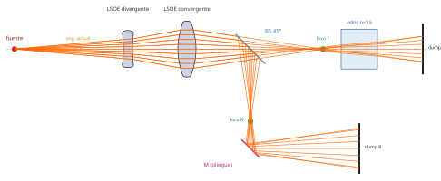

Three aplanatic lenses chained into a 1:1 relay of six Cartesian surfaces. The aplanatism
condition is a *product* over surfaces, so chaining aplanatic elements keeps the system
aplanatic — `(M − 1)_RMS = 4.9·10⁻¹⁶` across all six:

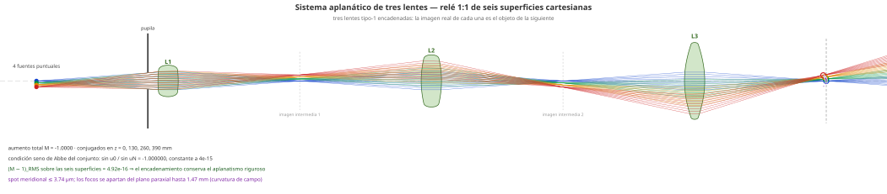

Two stigmatic singlets turning a point source into a plane wavefront, collimated to
**0.009°**:

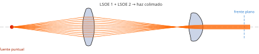

The rest of this page is a full guide: [installation](#installation), the
[basic optical elements](#basic-optical-elements) inherited from upstream, the
[stigmatic](#stigmatism) Cartesian-oval surfaces and LSOE lenses, and the
[aplanatic](#aplanatism) aberration-free-in-two-senses lenses.

---

## Installation

### 1. Install Inkscape 1.2 or newer

Download from https://inkscape.org/release/. The extensions use only `numpy`, `lxml` and
`inkex`, all of which ship with modern Inkscape — there is nothing else to install for
normal use.

### 2. Find your user extensions directory

In Inkscape open **Edit → Preferences → System** and read the **User extensions** field.
The usual locations are:

| OS | Path |
|---|---|
| **Linux** | `~/.config/inkscape/extensions/` |
| **macOS** | `~/Library/Application Support/org.inkscape.Inkscape/config/inkscape/extensions/` |
| **Windows** | `%APPDATA%\inkscape\extensions\` |

### 3. Copy the extension files

```bash
git clone https://github.com/GoofyCorleone/Stigmatic_RT_Inkscape.git
cd Stigmatic_RT_Inkscape
```

Copy the **contents of** `inkscape-raytracing/inkscape_raytracing/` into that directory:

**Linux**
```bash
cp -r inkscape-raytracing/inkscape_raytracing/* ~/.config/inkscape/extensions/
```

**macOS**
```bash
cp -r inkscape-raytracing/inkscape_raytracing/* \
      ~/Library/Application\ Support/org.inkscape.Inkscape/config/inkscape/extensions/
```

**Windows** (PowerShell)
```powershell
Copy-Item -Recurse -Force `
  .\inkscape-raytracing\inkscape_raytracing\* `
  "$env:APPDATA\inkscape\extensions\"
```

Restart Inkscape. Under **Extensions → Optics** you should now see:

- **Ray Tracing** — traces rays through the scene *(upstream)*
- **Set material as** — tags a shape as mirror, glass, beam… *(upstream)*
- **Superficie Cartesiana** — one stigmatic surface *(new)*
- **Lente Ovoide (LSOE)** — stigmatic singlet *(new)*
- **Lente Aplanática** — aplanatic singlet *(new)*

> **Troubleshooting.** If the new entries do not appear, check that the `.inx` files landed
> directly in the extensions directory (not in a sub-folder) and look at
> **Extensions → Previous Extension** or Inkscape's error dialog for a Python traceback.
> On Windows, make sure the copy did not create a nested
> `extensions\inkscape_raytracing\` folder.

### 4. Optional: running the scripts outside Inkscape

The example figures in this documentation are produced by standalone scripts that do not
need Inkscape at all. For those you want a virtual environment:

```bash
python -m venv venv
source venv/bin/activate          # Windows: venv\Scripts\activate
pip install numpy scipy matplotlib

python generar_ejemplos.py            # the basic before/after figures
python generar_ejemplos_avanzados.py  # collimator, multi-element rig, full system
python generar_ejemplos_aplanaticos.py  # the four aplanatic types + 3-lens relay
python generar_capturas_ui.py         # regenerate the dialog images in docs/img/
```

To run the test suite:

```bash
cd inkscape-raytracing
python -m pytest tests/unit -q
```

> `tests/integration/` currently fails to collect: those upstream tests import a module
> layout this fork no longer has. Run `tests/unit` only.

---

## Basic optical elements

Everything in this section comes from the **upstream**
[inkscape-raytracing](https://github.com/damienBloch/inkscape-raytracing) extension by
Damien Bloch. It is the foundation the rest of the project builds on, so it is worth
understanding before moving to the stigmatic and aplanatic generators.

### The idea

There is no separate "optics file format". You draw ordinary Inkscape shapes, and then you
**tag** them with what they are made of. The tag lives in the object's description field
(`Object → Object Properties → Description`) and looks like this:

```
optics:mirror
optics:glass:1.5168
optics:beam
optics:beam_dump
optics:beam_splitter
```

Then you select everything and run the tracer, which walks the rays through the scene.
Because the tag is just text in the SVG, anything that can write an SVG can build an
optical system — which is exactly how the generators in this project work.

### The five materials

| Tag | Behaviour |
|---|---|
| `optics:beam` | **not** an object: a seed ray. The tracer takes the *end point* of the path as the ray origin and the path's final tangent as its direction |
| `optics:mirror` | reflects |
| `optics:glass:n` | refracts by Snell's law with refractive index `n`; the shape must be closed, and the tracer treats its inside as the medium |
| `optics:beam_splitter` | splits each incoming ray into a transmitted and a reflected one |
| `optics:beam_dump` | absorbs — use it for apertures, stops and screens |

The document border acts as an implicit beam dump, so rays never escape to infinity.

### Tagging a shape: Set material as

Select a shape and run **Extensions → Optics → Set material as**. It writes the right tag
into the description for you:


| Field | Meaning |
|---|---|
| **Select material** | which `optics:` tag to write |
| **Optical index** | only used when the material is *Glass*; `1.5168` is N-BK7 at the sodium line |

You can equally type the tag by hand into **Object Properties → Description** — the tracer
only reads the text.

### Tracing: Ray Tracing

Select the objects you want included (usually `Ctrl+A`) and run
**Extensions → Optics → Ray Tracing**. It has no parameters:


The traced rays are written into a new layer called `generated_beams`, inside the layer
that held the seed beam. Because it is a normal layer you can restyle, hide or delete the
result and trace again after changing the scene.

### A first system, step by step

1. **Draw the optics.** A closed path for a lens, a straight segment for a mirror.
2. **Tag them.** Select the lens → *Set material as* → *Glass*, index `1.5`. Select the
   mirror → *Set material as* → *Mirror*.
3. **Draw the seed rays.** One short straight segment per ray. Remember the direction rule:
   the ray starts at the **end** of the segment and continues along its direction, so draw
   each segment *pointing where the light should go*.
4. **Tag the rays** as *Beam*.
5. **Select all** and run *Ray Tracing*.

A worked example that already contains every tag is
[`lsoe_raytracing.svg`](lsoe_raytracing.svg) — open it in Inkscape, press `Ctrl+A`, and
run the tracer.

### What a traced scene looks like

Here is a single-pass rig that uses **every** primitive at once — lens, beam splitter,
mirror, glass block and two beam dumps — before and after tracing:

| Before | After tracing |
|---|---|
| 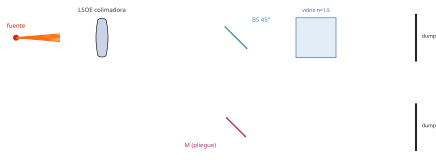 | 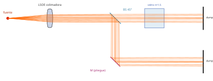 |

Each ray refracts at the lens, splits at the 45° beam splitter into a transmitted and a
reflected copy, and then either crosses the glass slab (transmitted arm, picking up the two
parallel shifts a plate produces) or bounces off the fold mirror (reflected arm), before
being absorbed by a dump.

### Practical notes

**Draw beams in the direction of propagation.** This trips up everyone once. The seed is
the path's *end point*, so a segment drawn from the lens back to the source will send light
the wrong way.

**Glass shapes must be closed.** An open path has no inside, and the tracer cannot decide
when a ray is entering or leaving the medium.

**Beams must live inside an Inkscape layer.** Upstream, a beam sitting at the document root
was silently ignored. This fork adds a fallback that puts the generated layer at the root
instead, so externally generated SVGs (like all the examples here) trace correctly.

**Beam splitters double the ray count.** Every splitter multiplies the number of
trajectories by two, so a scene with several of them and a recursive path can explode.
Terminate arms with beam dumps.

**Precision.** For finely sampled curves, this fork raises inkex's number template from
`{:.6g}` to `{:.10g}` and reads path `d` attributes directly. Without that, coordinates get
quantised to ~10⁻³ px, which corrupts the normals of small Bézier segments and produces
refraction errors of up to ~1°. See [Numerical accuracy](#numerical-accuracy) for the full
story.

---

## Stigmatism

### The theory in one page

A surface is **stigmatic** for a pair of points `P₀` and `P₁` when *every* ray leaving `P₀`
arrives at `P₁` — not approximately, not for small angles, but exactly. Fermat's principle
says this happens when the optical path length is the same along all of them:

```
n₀ · |P − P₀|  +  n₁ · |P − P₁|  =  constant
```

for every point `P` on the surface. That equation defines a quartic surface of revolution
known since Descartes as the **Cartesian oval**. A sphere is the special case; the general
oval is what you need when the conjugates are not at the Young points.

Two details matter in practice:

**Virtual images flip a sign.** If the image is virtual the invariant is the *difference*
of optical paths, `n₀·l₀ − n₁·l₁ = k`, not the sum. Using the sum regardless produces a
surface that simply is not stigmatic. Internally the code carries signed indices
`m₀ = ±n₀`, `m₁ = ±n₁` so both cases come out of one formula.

**The shape parameters.** Silva-Lora's formulation (the GOTS parameters) writes the surface
profile as

```
τ(ρ) = (O + T·ρ²)·ρ² / [ 1 + S·ρ² + √(1 + (2S − O·OG)·ρ²) ]
z(ρ) = ζ + τ(ρ)
```

where `ρ` is the distance from the vertex to the point on the surface, and

| Symbol | Meaning | Units |
|---|---|---|
| `O` | paraxial curvature, `1/R`, signed | 1/length |
| `T` | fourth-order deformation | 1/length³ |
| `S` | conic-coupling term | 1/length² |
| `G` | axial shift; `OG = O·G` | length |
| `ζ` | vertex position on the axis | length |

`calcular_gots(n_k, n_k1, ζ, d_k, d_k1)` converts the physical description — the indices
and the two conjugate positions — into `(G, O, T, S, OG)` through Silva-Lora's Eqs. 10–13.
Everything else in the project is built on top of that one function.

#### The mathematical core (`gots_util.py`)

A self-contained module, numpy only, shared by all three extensions and by the standalone
scripts:

| Function | What it does |
|---|---|
| `calcular_gots(n_k, n_k1, ζ, d_k, d_k1)` | physical parameters → GOTS (Eqs. 10–13), with degeneracy checks |
| `perfil_superficie(params, N, r_max)` | meridional profile `(r, z)` from GOTS (Eq. 16) |
| `perfil_ovoide_descartes(n0, n1, ζ, d_obj, d_img, N)` | closed Descartes oval straight from the Fermat invariant, signed for real/virtual images |
| `encontrar_apertura(p0, p1)` | radius at which two surface profiles intersect — the largest physical lens |
| `calcular_d1_sigma(σ, ζ0, ζ1, d0, d2, n0, n1, n2)` | intermediate image position realising a given shape factor |
| `puntos_a_bezier_path_str(pts, cerrar)` | points → SVG cubic Bézier with exact non-uniform (Bessel) tangents |

The aplanatic layer built on top of this is documented under
[How it is verified](#how-it-is-verified).

Going the other way — GOTS back to physical parameters — is not implemented, but it is
straightforward algebra: `O` and `S` give two equations in the two unknowns `ξ = d_k − ζ`
and `η = d_{k+1} − ζ`.

### Superficie Cartesiana — a single surface

**Extensions → Optics → Superficie Cartesiana** draws one refracting surface. It has three
tabs.

#### Tab 1 — Parámetros Físicos

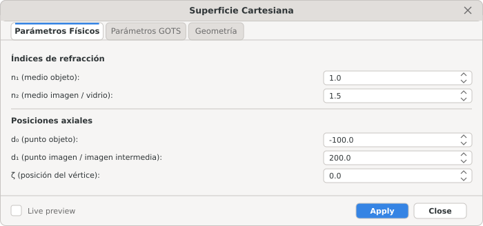

This is the tab you normally use: describe the optics you want and let the extension work
out the shape.

| Field (Spanish) | Meaning |
|---|---|
| `n₁` | refractive index *before* the surface (object side) |
| `n₂` | refractive index *after* the surface |
| `d₀ (punto objeto)` | axial position of the object point |
| `d₁ (punto imagen)` | axial position of the image point |
| `ζ (vértice)` | axial position of the surface vertex |

All positions are absolute coordinates on the optical axis, so the sign convention takes
care of itself: an object to the left of the vertex has `d₀ < ζ`, and an image to the right
has `d₁ > ζ`. If `d₁ < ζ` the image is virtual and the extension automatically switches to
the difference invariant and draws a concave surface closed by a rectangular glass body.

#### Tab 2 — Parámetros GOTS

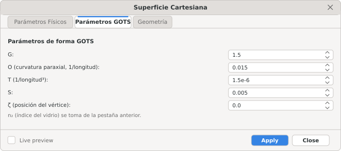

Skip the physics and give the shape parameters directly. This is for teaching figures and
parameter sweeps: fix three of `(G, O, T, S)` and vary the fourth to see what each one does
to the profile.

#### Tab 3 — Geometría

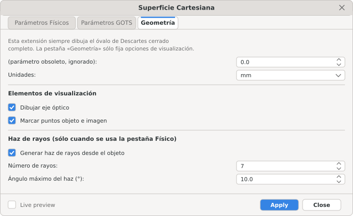

Presentation only: aperture radius (`0` = pick automatically), drawing units, whether to
draw the optical axis and the object/image markers, and how dense the test ray fan should
be.

#### Result

A surface designed for `n₁ = 1`, `n₂ = 1.5`, object at −100 mm, image at +200 mm, before
and after tracing:

| Before | After tracing |
|---|---|
| 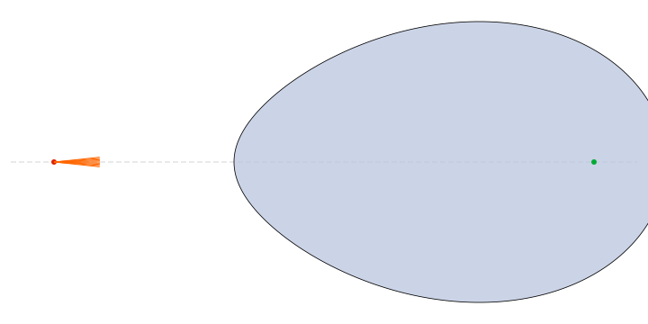 | 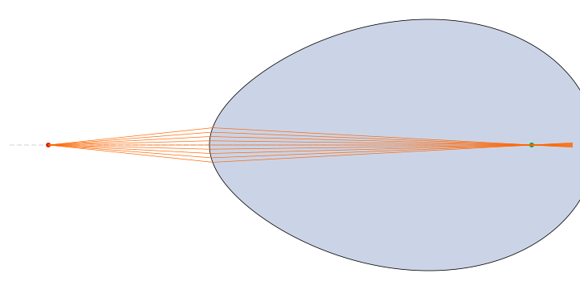 |

Every ray meets the green image point — that is what "rigorously stigmatic" buys you, at a
numerical aperture where a sphere would smear the focus badly.

### Lente Ovoide (LSOE) — a stigmatic singlet

A **LSOE** (*Lente Singlete Ovoide Estigmática*) is a lens whose **two** surfaces are
Cartesian ovals, arranged so the intermediate image of the first is the object of the
second. The pair is then stigmatic for the overall conjugates.

There is one degree of freedom left: where to put that intermediate image. Moving it
redistributes curvature between the two faces without changing the conjugates, which is
exactly the classical **shape factor σ**:

| σ | Shape |
|---|---|
| `−1` | plano-convex, flat front |
| `0` | symmetric biconvex |
| `+1` | convex-plano, flat back |

`calcular_d1_sigma` solves for the intermediate image position that realises a requested σ.

#### Tab 1 — Diseño de la lente

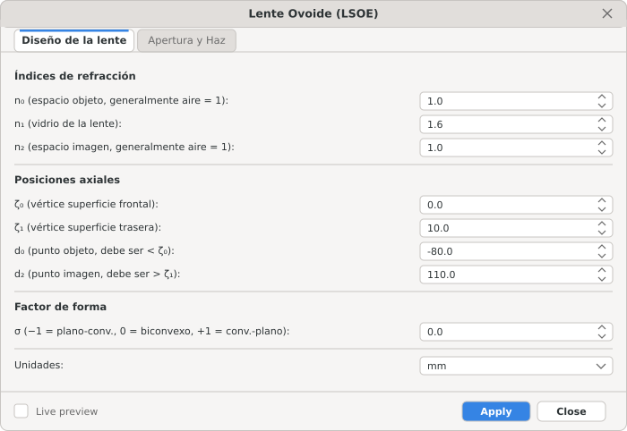

| Field | Meaning |
|---|---|
| `n₀ / n₁ / n₂` | object space, lens glass, image space |
| `ζ₀ / ζ₁` | vertices of the front and back surfaces (their difference is the axial thickness) |
| `d₀ / d₂` | object and image positions |
| `σ` | shape factor |

#### Tab 2 — Apertura y Haz

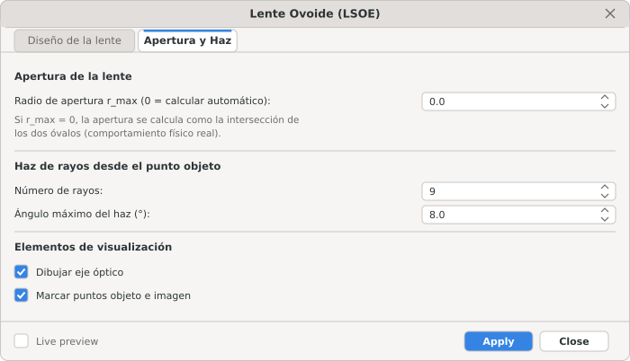

Aperture radius (`0` lets the extension use the radius at which the two ovals intersect,
which is the physically largest lens you can cut), number of rays, fan half-angle, and the
axis/marker switches.

#### Result

A biconvex LSOE for object at 0 mm, image at 200 mm, `n₁ = 1.6`, σ = 0, with 11 rays out to
±7°:

| Before | After tracing |
|---|---|
| 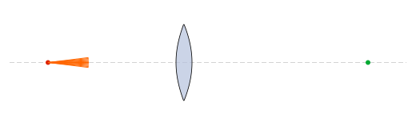 | 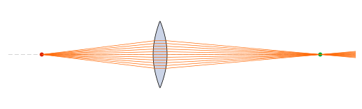 |

### Divergent configurations

Both generators also produce rigorously stigmatic **virtual** images. Here a biconcave LSOE
and a concave Cartesian surface, both with the object at −100 mm and the virtual image at
−40 mm — between the object and the element, as a diverging system requires:

| Divergent LSOE — before | after |
|---|---|
| 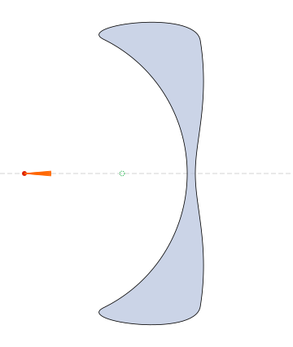 | 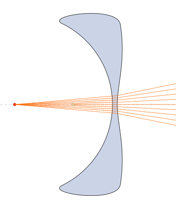 |

| Divergent surface — before | after |
|---|---|
| 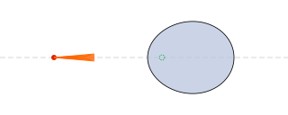 | 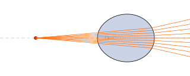 |

The dashed back-extrapolations of the refracted rays meet exactly at the virtual image
point.

> **Why the divergent surface is drawn with a body.** The full closed Descartes oval is not
> traceable in this configuration: its back cap sits between the object and the designed
> surface and would intercept the rays first. The extension therefore draws only the
> designed concave branch and closes it with a rectangular glass body toward `+z`.

### Composite systems

Stigmatism survives chaining, so you can build real instruments. Two LSOEs turning a point
source into a plane wavefront — the second lens images the first one's focus to infinity:

| Before | After tracing |
|---|---|
| 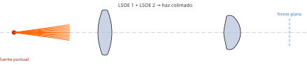 |  |

Collimation error: **0.009°**.

And the full rig — a divergent LSOE whose virtual image is the object of a convergent LSOE,
then a beam splitter feeding a glass slab on one arm and a fold mirror on the other:

| Before | After tracing |
|---|---|
| 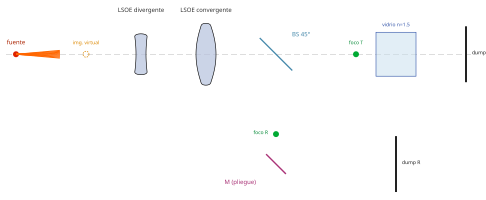 |  |

Traced through the *actual* Inkscape extension, all 18 trajectories (9 rays × 2 arms)
converge at both foci to within **0.011 mm**.

#### Rule of thumb

| Configuration | Object `d₀` | Image | Shape |
|---|---|---|---|
| Convergent, real image | any | on the far side of the element, or further away than the object | convex / biconvex |
| Divergent, virtual image | real (before the vertex) | same side as the object and **closer** to it | concave / biconcave |

If the extension stops with *"parámetro degenerado"*, the configuration is geometrically
impossible — object or image sitting on the vertex, `n₁ = n₂`, or `κ = n₁·η − n₀·ξ = 0`.
Move `d₀`, `d₁` or `ζ`.

### Tutorial: build a stigmatic lens yourself

1. Run **Extensions → Optics → Lente Ovoide (LSOE)**.
2. On *Diseño*, set `n₁ = 1.6`, `ζ₀ = 0`, `ζ₁ = 10`, `d₀ = −80`, `d₂ = 110`, `σ = 0`.
3. On *Apertura y Haz*, leave the aperture at `0`, set 11 rays and a 7° half-angle.
4. Press **Apply**. You get the lens, the axis, the object/image markers and the seed rays.
5. Press `Ctrl+A`, then **Extensions → Optics → Ray Tracing**.

The rays should meet at the green marker. Now go back and change σ to `−1` and re-run: the
lens becomes plano-convex, the shape changes completely — and the focus stays exact. That
is the point of the whole formulation.

To do the same without opening Inkscape:

```bash
python generar_lsoe_svg.py       # writes lsoe_raytracing.svg, ready to trace
python generar_ejemplos.py       # regenerates the before/after figures above
```

### Numerical accuracy

Getting exact optics through an SVG round-trip is harder than the maths. Three fixes make
the in-Inkscape result agree with an independent exact tracer to ≈0.001° and a few µm:

1. **Spline→Bézier handles.** The profile is converted with the exact non-uniform
   (Bessel) formula `P₁ = pᵢ + mᵢ·hᵢ/3`. Fixed-tension handles were twice too long and
   bulged the surface between nodes at order `h²`, which visibly walked the focus.
2. **inkex path precision.** `render.py` reads `d` attributes directly and raises inkex's
   number template from `{:.6g}` to `{:.10g}`. The default six significant digits quantise
   coordinates to ~10⁻³ px, corrupting the normals of fine Bézier segments — errors that
   got *worse* with denser sampling, which is how the bug was eventually found.
3. **Point decimation and closure.** Nearly coincident profile points are merged before
   emitting the path, and a closed contour never repeats its first point: a zero-length
   closing chord degenerates the Bessel tangent and puts a microscopic crease at the
   vertex, which deflects precisely the axial rays.

Traced beams are also drawn compensating the containing layer's transform, and beams
outside any layer fall back to a root-level `generated_beams` layer instead of being
dropped.

---

## Aplanatism

### Why stigmatism is not enough

A stigmatic surface images **one** point perfectly. Move the object sideways by a
millimetre and the guarantee is gone — the off-axis image grows a comet-shaped flare, which
is exactly what the aberration called **coma** looks like.

To image an *extended* object you need the neighbourhood of the axial point to be imaged
sharply too. Abbe's answer (1873) is the **sine condition**: the system must keep

```
sin u₀ / sin u_N  =  (n_N / n₀) · M
```

*constant* for every ray leaving the axial object point, where `u₀` and `u_N` are the angles
the ray makes with the axis on entering and leaving, and `M` is the lateral magnification.
A system that is both stigmatic and satisfies the sine condition is **aplanatic**: free of
spherical aberration *and* coma, simultaneously.

### The generalized condition

Chapter 4 of Silva-Lora's thesis combines the sine condition with the rigorous-stigmatism
formulation and arrives at a condition written directly in the GOTS shape parameters. For a
system of `N` Cartesian surfaces:

```
𝓜(N, ρₖ) = ∏ₖ (n_{k+1}/n_k) · [ 1/(d_{k+1} − ζₖ) − 1/V̄C̄ₖ ] / [ 1/(dₖ − ζₖ) − 1/V̄C̄ₖ ] = 1
```

for every ray. `V̄C̄ₖ` is the distance from the vertex to the point where the surface normal
crosses the axis — for a sphere it is just the radius, and for a general Cartesian oval it
depends on where the ray strikes:

```
1/V̄C̄ = [ O + 2(2T − S·O)·ρ² / (1 + rad) ] / rad ,   rad = √(1 + (2S − O·OG)·ρ²)
```

> The form published in the thesis (Eq. 92) divides by `G` and by `O`, both of which vanish
> in two of the four families below. Using the identity `T = S²/OG`, which holds identically
> for the GOTS parameters, it can be rewritten as above — finite in every degenerate limit.
> That is the form `inversa_vc` implements.

Two consequences are worth keeping in mind:

- **𝓜 is a product over surfaces.** Chaining aplanatic elements gives an aplanatic system,
  which is why the three-lens relay further down works.
- **Aplanatism does not remove the other aberrations.** Astigmatism, field curvature and
  distortion survive. This matters for reading the figures — see
  [where the image really forms](#where-the-image-really-forms).

### The four rigorously aplanatic families

Setting `𝓜 ≡ 1` exactly, rather than minimising it numerically, yields four closed-form
solutions (§4.4 of the thesis):

| Type | Condition | Surfaces | Image | Extra |
|---|---|---|---|---|
| **Tipo-0** | `2Sₖ = GₖOₖ²` | spheres at the **Young points** | virtual | also free of astigmatism (**anastigmatic**) |
| **Tipo-1** | `d₁ → ∞` | identical conics, collimated interior | real (`M = −1`, biconvex) or virtual (`M = +1`, meniscus) | the classic biconic |
| **Tipo-2** | `Oₖ = 0` | flat-vertex ovoids | virtual | generalises the plane-parallel plate; ophthalmic-style |
| **Tipo-3** | `Gₖ = 0` | ovoids | virtual | positive meniscus |

All four are implemented in `disenar_aplanatica`, and
[`tests/unit/test_aplanatico.py`](inkscape-raytracing/tests/unit/test_aplanatico.py)
checks them against Tables 6–9 of the thesis. The conjugates come out exactly as tabulated:
`d₁ = 26.666667, d₂ = −8` (Table 6), `d₁ = ∞, d₂ = 130` (Table 7), `d₂ = 4.444444`
(Table 8), `d₁ = 41.481481, d₂ = −22.4` (Table 9).

Note that in air all four have `|M| = 1`. That is not a limitation of the implementation but
a property of the theory: types 2 and 3 require `n₂ = n₀` for `𝓜 = 1` (Eq. 112), and a
type-0 air-to-air singlet has `M = (n₀/n₂)² = 1`. Magnification other than unity needs
immersion or a non-rigorous, optimised design.

### The aplanatic extension

**Extensions → Optics → Lente Aplanática**, four tabs.

#### Tab 1 — Diseño

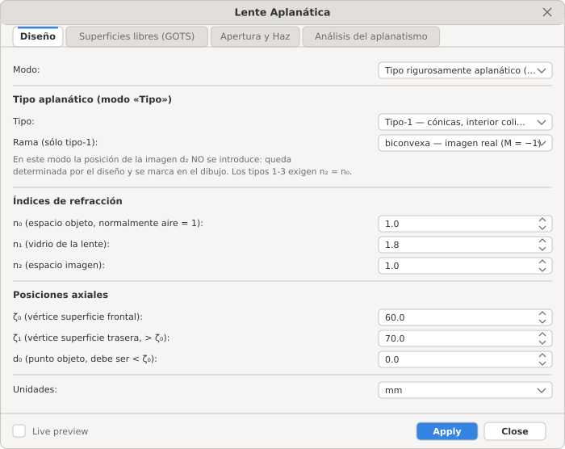

| Field | Meaning |
|---|---|
| `Modo` | *Tipo* uses one of the four closed-form families; *Superficies libres* lets you enter conjugates yourself (next tab) |
| `Tipo` | which family (0–3) |
| `Rama` | type-1 only: `real` gives the biconvex, real-image branch; `virtual` the meniscus |
| `n₀ / n₁ / n₂` | object space, glass, image space. Types 1–3 force `n₂ = n₀` and warn if you set otherwise |
| `ζ₀ / ζ₁` | the two vertices |
| `d₀` | object position |

The important difference from the stigmatic generators: **you do not enter the image
position**. `d₂` is *derived* from the aplanatism condition and drawn on the canvas — a
filled circle if the image is real, hollow if virtual.

#### Tab 2 — Superficies libres (GOTS)

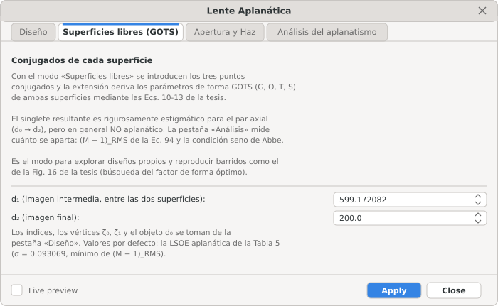

The general mode. You give all three conjugates `d₀, d₁, d₂` and the extension derives the
GOTS parameters of both surfaces with `calcular_gots`. The singlet is rigorously stigmatic
for the axial pair but in general **not** aplanatic — the Análisis tab tells you how far off
it is, via the `(M − 1)_RMS` metric of Eq. 94.

This is the mode for exploring your own designs, and for reproducing the σ sweep of Fig. 16
of the thesis, where the best-form singlet is found by minimising that metric.

#### Tab 3 — Apertura y Haz

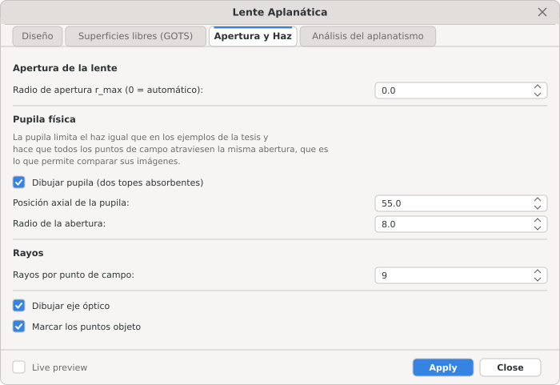

Aperture (`0` = automatic, clipped where the two surfaces would cross), the **physical
pupil** and the ray count. The pupil matters more than it looks: limiting the beam with a
real stop rather than a fixed cone angle is what makes different field points comparable,
because they all cross the same opening. Every figure in the thesis is built that way.

#### Tab 4 — Análisis del aplanatismo

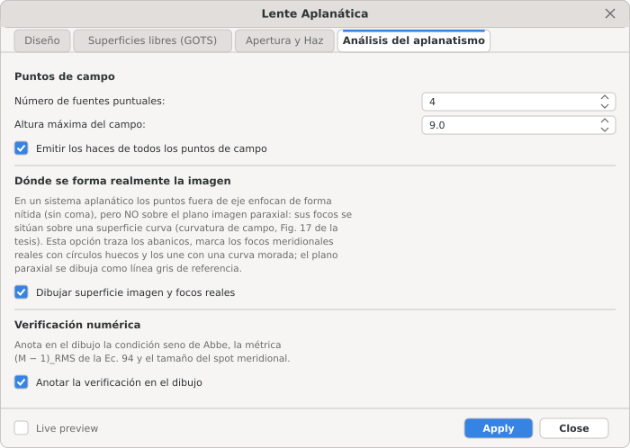

This is where the extension answers the question "did I actually get an aplanatic lens, and
where does it form the image?".

| Field | Meaning |
|---|---|
| `Número de fuentes puntuales` | how many field points to trace |
| `Altura máxima del campo` | the largest object height |
| `Emitir los haces…` | write the seed rays so you can trace in Inkscape |
| `Dibujar superficie imagen y focos reales` | trace each fan, mark its **real** meridional focus with a hollow circle, join them with a purple curve, and draw the paraxial plane in grey for contrast |
| `Anotar la verificación en el dibujo` | write the Abbe sine ratio, `(M − 1)_RMS`, the spot size and the departure from the paraxial plane onto the canvas, with an explicit `APLANÁTICO en todo rigor` / `NO aplanático` verdict |

### Where the image really forms

This is the part that is easy to get wrong, so the figures are built to make it obvious.

An aplanatic lens images off-axis points **sharply** — that is the whole point. But those
sharp images do **not** lie on the paraxial image plane: the locus of the real foci is a
**curved surface**. The thesis says so explicitly in Fig. 17 ("cuya imagen se forma sobre
una superficie curva") and discusses it on p. 101, where it also separates the meridional
from the sagittal focal surface.

So each figure below traces **four point sources** at different field heights through a
physical pupil, finds the real meridional focus of every fan, and draws:

- **hollow circles** — the real foci,
- a **purple dashed curve** through them — the image surface,
- a **grey line** — the paraxial plane, for reference only,
- an **inset** magnifying the image region along `z` (×3 to ×122 depending on the type),
  because at true scale the departure is only tenths of a millimetre.

| | |
|---|---|
| 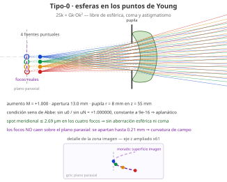 | 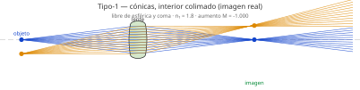 |
| 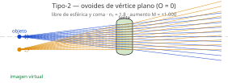 | 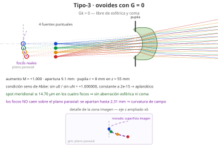 |

Reading the numbers on the figures:

| Type | Meridional spot at the real foci | Departure from the paraxial plane |
|---|---|---|
| Tipo-0 | 2.7 µm | 0.21 mm |
| Tipo-1 | 23 µm | 3.78 mm |
| Tipo-2 | 1.3 µm | 0.11 mm |
| Tipo-3 | 15 µm | 2.32 mm |

Sharp foci, curved surface. For the anastigmatic tipo-0 the residual matches the ≈60 µm the
thesis reports at full field (Fig. 22).

### A three-lens aplanatic system

Because `𝓜` is a product over surfaces, aplanatic elements chain. Three type-1 lenses form
a 1:1 relay of six Cartesian surfaces — the real image of each is the object of the next:


| Quantity | Value |
|---|---|
| Total magnification | `−1.0000` |
| `(M − 1)_RMS` over the six surfaces | **4.9·10⁻¹⁶** |
| Abbe sine ratio of the whole train | `−1.000000`, constant to `4·10⁻¹⁵` |
| Conjugates | z = 0 → 130 → 260 → 390 mm |

[`ejemplo_aplanatica_3lentes_inkscape.svg`](ejemplo_aplanatica_3lentes_inkscape.svg)
carries the same geometry with the rays as `optics:beam` seeds. Open it, press `Ctrl+A` and
run **Ray Tracing**: all 36 beams land on the analytically predicted foci to within
**0.03–3.8 µm**.

### Aplanatic tutorial

**Design a lens.**

1. **Extensions → Optics → Lente Aplanática**.
2. *Diseño*: leave `Modo = Tipo`, pick `Tipo-1`, `Rama = biconvexa`. Keep the defaults
   `n₁ = 1.8`, `ζ₀ = 60`, `ζ₁ = 70`, `d₀ = 0` — they reproduce Table 7 of the thesis.
3. *Apertura y Haz*: pupil radius `8` at `z = 55`, 9 rays.
4. *Análisis*: 4 field points up to `9`, both checkboxes on.
5. **Apply.**

You get the lens, the pupil, four coloured fans, the curved image surface with its real
foci, and a block of text stating the sine ratio, `(M − 1)_RMS = 0` and the verdict
`APLANÁTICO en todo rigor`.

**See a design fail the test.** Switch *Modo* to `Superficies libres` and, on tab 2, enter
`d₁ = 599.172082`, `d₂ = 200`. Apply again: the annotation now reads
`(M − 1)_RMS ≈ 1.5·10⁻²` and `NO aplanático`, and the foci scatter. That design *is*
rigorously stigmatic on axis — it just is not aplanatic.

**Reproduce the figures without Inkscape.**

```bash
python generar_ejemplos_aplanaticos.py
```

writes the four type figures plus the three-lens relay and its traceable variant.

### How it is verified

The aplanatic layer of `gots_util.py`:

| Function | What it does |
|---|---|
| `disenar_aplanatica(tipo, n0, n1, ζ0, ζ1, d0, …)` | conjugates, per-surface GOTS and lateral magnification for each of the four families |
| `inversa_vc(sup, ρ)` | `1/V̄C̄ₖ` (Eq. 92) in the degeneracy-free form given above |
| `factor_aplanatismo` / `condicion_aplanatismo` | the per-surface factor and the product `𝓜(N, ρₖ)` (Eqs. 78/93) |
| `rms_aplanatismo(valores)` | `(M − 1)_RMS` (Eq. 94) — the error metric for approximate designs |
| `perfil_superficie_aplanatica(sup, r_max, N)` | profile sampled to a *requested* aperture (types 1–3 have an unbounded `ρ` domain, so the generic sampler would put nearly every node outside the lens) |
| `trazar_rayo(superficies, P, d, r_max)` | exact ray trace through the analytic surfaces, per-surface apertures allowed |
| `foco_meridional(origenes, direcciones)` | best-crossing point of a fan and its spot radius |
| `superficie_imagen(…)` | the curved image surface: real focus and spot per field height |
| `seno_abbe(…)` | the sine ratio on the axial pair and its dispersion |
| `alturas_estigmaticas(diseno, ρ₀)` | chains the exact stigmatic geometry to get `ρ₀ → ρ₁` without a tracer |

The module traces its own designs exactly (`trazar_rayo`, the method of chapter 3 of the
thesis), independently of the Bézier approximation written into the SVG. Against that
reference:

| Check | Result |
|---|---|
| Axial focus of all four types | exact to **< 1 nm**, spot **0 nm** |
| Abbe sine ratio | equals `(n_N/n₀)·M` to **10⁻¹⁶**, constant across the fan |
| Identity `sin u₀/sin u_N = (n_N/n₀)·M·𝓜(ρₖ)` (Eqs. 77/86/87) | holds to **10⁻¹⁵** on aplanatic *and* non-aplanatic designs |
| Through the real `render.py` pipeline | foci to **≤ 6·10⁻⁵ mm**, sine ratio constant to ~10⁻⁶ |

That last identity is the strongest check available: it ties `inversa_vc`,
`condicion_aplanatismo` and the exact tracer together, and fails loudly if any one of them
is wrong.

A geometric detail that makes the tracer clean: by the very property that defines `V̄C̄ₖ`
(Eq. 90), the normal at any point of a Cartesian surface crosses the axis at
`Cₖ = ζₖ + V̄C̄ₖ`. So the normal direction is `n̂ ∝ (q·(z − ζ) − 1, q·r)` with `q = 1/V̄C̄ₖ`
— which stays finite even for a flat surface, where `q = 0` and the normal is axial.

### Two traps worth knowing

**Pick the right branch of the surface.** A ray coming from the left hits the *far* side of
a sphere, or the back branch of an ovoid, long before it reaches the designed surface. The
intersection search must be restricted to the useful cap (`ρ ≤ ρ(r_max)`); without that
bound, types 0 and 3 silently produced completely wrong foci.

**Do not iterate an aperture estimate.** Sizing a lens by tracing, measuring the maximum ray
height and shrinking the aperture to match converges to a *false* fixed point: once the
aperture tightens, the rays that exceed it get vignetted and stop contributing to the
maximum. Measure once with a generous trial aperture, then clamp to the radius where the
two surfaces of the lens cross — beyond that the element has no thickness at all.

### A note on Table 5 of the thesis

The free-surface mode reproduces surface 0 of Table 5 exactly
(`G = −2.719771, O = 0.025006, T = −2.613020·10⁻⁸, S = −4.215636·10⁻⁵`) but not surface 1.
The reason is an inconsistency in the source: the table places the final image at `d₂ = 200`
while the surrounding text specifies `d₂ = 120 mm`. Sweeping `d₂` with `d₁ = 599.172082`
fixed puts the minimum of `(M − 1)_RMS` at **d₂ ≈ 120.17**, confirming the text rather than
the table.

### What is not implemented yet

- **Approximate (best-form) design** by sweeping `d₁` to minimise `(M − 1)_RMS` — the metric
  and the exact tracer are both in place, only the optimisation loop is missing (§4.3.7 and
  Fig. 16 of the thesis).
- **Primary aberration coefficients** (chapter 5) and **achromatism** (chapter 6).

---

## Repository layout

```
README.md                          this page (full guide)
docs/
  img/                             dialog reference images used above
generar_lsoe_svg.py                minimal standalone LSOE generator
generar_ejemplos.py                basic before/after example figures
generar_ejemplos_avanzados.py      collimator, multi-element rig, full system
generar_ejemplos_aplanaticos.py    aplanatic types and three-lens relay
generar_capturas_ui.py             renders docs/img/ from the .inx files
ejemplo_*.svg                      pre-generated example figures
inkscape-raytracing/
  inkscape_raytracing/
    gots_util.py                   ★ mathematical core (numpy only)
    superficie_cartesiana.py/.inx  ★ single stigmatic surface
    lente_ovoide.py/.inx           ★ stigmatic singlet
    lente_aplanatica.py/.inx       ★ aplanatic singlet
    render.py/.inx                 ray tracer (upstream, precision-patched)
    raytracing/                    ray-tracing engine (upstream)
  tests/unit/                      geometry, math and aplanatic designs
```

A note on language: this documentation is in English, but **the source code and the
extension dialogs are in Spanish** (`fuente`, `apertura`, `superficies`, …), which is the
convention of the wider repository this project lives in. The dialog images throughout
therefore show Spanish labels; each field is translated where it appears.

---

## Credits and license

- Upstream engine and Inkscape integration: **Damien Bloch**,
  [inkscape-raytracing](https://github.com/damienBloch/inkscape-raytracing).
- Optical theory: **Alberto Luis Silva Lora**, *Estudio de las aberraciones primarias a
  partir de la teoría del estigmatismo riguroso*, Universidad Industrial de Santander, 2024,
  and the Silva-Lora & Torres papers cited therein.
- This fork follows the upstream license.
